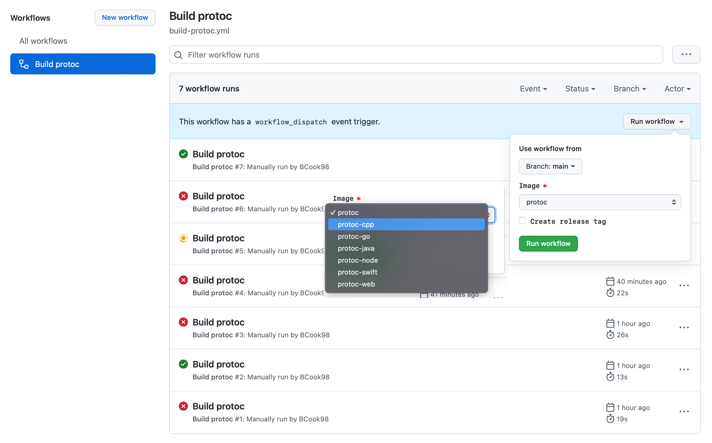

# Protobuf Compiler Docker Containers

## Overview

This repository contains Dockerfiles that build protocol buffer generation scripts for SafetyCulture's supported languages. Removing the need to setup Protoc (v3) on your local machine. It relies on setting a simple volume to the docker container, and it will take care of the rest.

There are a number of images published for different language support

- `ghcr.io/safetyculture/protoc`
- `ghcr.io/safetyculture/protoc-cpp`
- `ghcr.io/safetyculture/protoc-go`
- `ghcr.io/safetyculture/protoc-java`
- `ghcr.io/safetyculture/protoc-node`
- `ghcr.io/safetyculture/protoc-swift`
- `ghcr.io/safetyculture/protoc-web`

## Usage

These images can be used to run `protoc` and the respective plugins to generate the required output:

```sh
docker run \
	-v $(PWD):/protos \
	-u $(UID) \
	-w /protos \
	--entrypoint "protoc" \
	ghcr.io/safetyculture/protoc-go:1.12.0 \
	-Iprotos -Ithird_party \
	--go_out $(GO_OUT_DIR)/ \
	--go-grpc_out $(GO_OUT_DIR)/ \
	--grpc-gateway_out $(GO_OUT_DIR)/ \
	--grpc-gateway_opt logtostderr=true \
	--grpc-gateway_opt generate_unbound_methods=true \
	--govalidator_out $(GO_OUT_DIR)/ \
	--go-vtproto_out $(GO_OUT_DIR)/ \
	--go-vtproto_opt=features=marshal+unmarshal+size \
  **/*.proto
```

## Building

1. update the version in xxx/version.txt. This version will be used to tag the new docker image.
1. update the relevant version info in the Dockerfile for the respective language.
1. trigger a new build https://github.com/SafetyCulture/protoc-docker/actions/workflows/build-protoc.yml and select the image you want to build.
If `Create release tag` is unselected the image will be tagged with `${version}-pre#{datetime}`.



Alternatively you can manaully build and publish these images by running the following make commands.

```txt
buildAll       Generates all the protoc docker containers
cpp            Builds the protoc docker container for `cpp`
go             Builds the protoc docker container for `go`
java           Builds the protoc docker container for `java`
node           Builds the protoc docker container for `node`
protoc         Builds the protoc docker container
swift          Builds the protoc docker container for `swift`
web            Builds the protoc docker container for `web`
```
